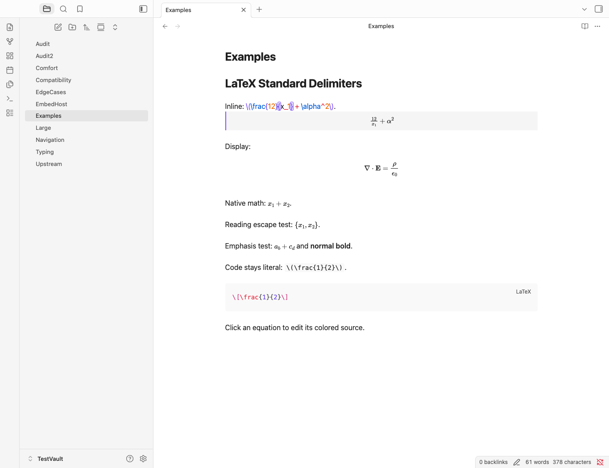
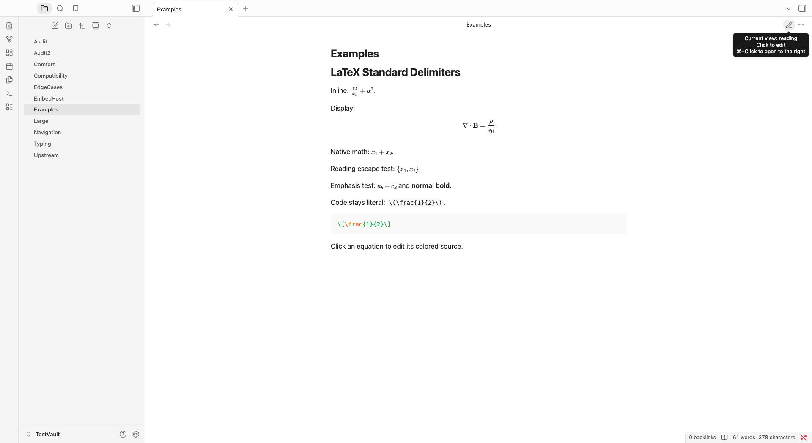

# LaTeX Standard Delimiters — beta

Verified locally on Obsidian 1.13.7. Beta releases are available from [GitHub Releases](https://github.com/DicksonKam/latex-standard-delimiters/releases).

Render `\(...\)` and `\[...\]` without rewriting Markdown. Reading View uses Obsidian's shared MathJax engine. Live Preview shows colored original source and an updating equation preview while editing. Native dollar math remains handled by Obsidian.

## Screenshots

Actual Obsidian 1.13.7 screenshots from a disposable test vault, using beta 0.3.1. The first shows colored inline source and its updating preview; the second shows Reading View. These are desktop examples, not mobile verification.





Distribution is through GitHub Releases and BRAT. Community Plugins listing is not planned. The retained MIT license permits this derivative; upstream attribution remains.

## Installation

Create `.obsidian/plugins/latex-standard-delimiters/` inside your vault. Download the three assets `main.js`, `manifest.json`, and `styles.css` from one release, or extract the release ZIP into that folder. The three files must be directly inside the plugin folder. Reload Obsidian and enable LaTeX Standard Delimiters under Community plugins. This plugin requires Obsidian 1.13.7 or newer; earlier versions have not been tested.

For beta updates, use [BRAT](https://github.com/TfTHacker/obsidian42-brat) 1.1.0 or newer with `DicksonKam/latex-standard-delimiters`. Alternatively, download `main.js`, `manifest.json`, and `styles.css` from the same GitHub release and replace those three plugin files. Keep your existing `data.json` preferences. A manual installation does not update automatically. See [Updates and recovery](UPDATING.md) for the tested BRAT update/rollback path.

## Editing

Click or tap a rendered equation to reveal source. Up/Down enters a display equation. Source receives command, brace, number, operator, comment and delimiter colors, with matching-brace feedback. A preview appears below a complete active equation; selections and multiple cursors suppress it. Disable editing previews in settings if preferred. Long previews scroll horizontally within their pane.

During IME composition, previews and source-marker replacement widgets are suppressed until composition ends. Synthetic lifecycle checks pass; real OS input-method testing is still outstanding. In built-in Vim normal mode, standard-delimiter math stays as source so native motions and counts retain logical lines. Insert mode restores ordinary rendering. This uses Obsidian's observed cm-vimMode DOM indicator, which must be rechecked on future host versions.

Source mode stays raw. Inline math must fit on one line. Multiline displays must occupy complete lines for Live Preview; list/callout-prefixed multiline displays remain unsupported there. Incomplete equations remain editable literal text. Malformed complete math uses MathJax's visible error feedback. Coloring is a tokenizer, not a TeX compiler.

## Rendering ownership and other tools

Settings offer Automatic and Off. Automatic pauses while the known upstream latex-delimiter-renderer ID is enabled and resumes after removal; Off leaves rendering to other tools. Rendering status explains the state. No other plugin's settings are changed. Other renderer IDs are not universally detected.

Extended MathJax supplies shared macros/configuration and remains compatible in tested load orders. Quick Latex native-dollar helpers coexist, but standard-delimiter snippet support is not added. SwiftLaTeX handles separate latex/latexsvg code blocks; its engine/coexistence checks passed, while full PDF/SVG compilation was not exercised. See COMPATIBILITY.md and TYPING-INTEGRATION.md.

## Platform and source preservation

Current releases target desktop, with isDesktopOnly=true. Mobile support and testing are outside the current scope. Production uses host/browser APIs, no Node or Electron imports, no note-write APIs, no telemetry and no remote rendering service. It saves only its own preferences. Earlier mobile checklists are retained as historical development material, not supported-platform commitments. See PLATFORM-AUDIT.md.

CSS uses the plugin's own lsd-math namespace. Theme variables supply default token colors; settings allow six-digit hex overrides. Exporters that bypass Obsidian's rendered DOM do not automatically gain support.

## Development and verification

Use supported Node 22 or 24. npm ci followed by npm run check validates versions, lint, tests, TypeScript and the production bundle. The final source passed 19 unit tests and 195 actual-app checks, including editing performance and Minimal/narrow-pane verification. VERIFICATION.md describes exact scope and outstanding gates.

Developer scripts run only in a disposable vault named TestVault and deliberately exercise editor contents/settings. Copy the supplied Markdown fixtures and preamble.sty there. For the compatibility fixture, copy `fixtures/Compatibility.md` into the vault root; `COMPATIBILITY.md` is the findings document. Install Extended MathJax 0.4.1, Quick Latex 2.6.5, SwiftLaTeX 0.6.0, upstream LaTeX Delimiter Renderer 1.0.4 and the Minimal theme stylesheet. Do not copy personal plugin data. For the SwiftLaTeX test copy, set data.json to {"enableCache":false,"package_url":"http://127.0.0.1:9/","compiler":0,"onlyRenderInReadingMode":false}. The upstream test used a local build of original source; package compilation is not part of SwiftLaTeX coexistence checks.

Keep Obsidian foreground. In its developer Console, set window.lsdTestScriptsPath to the absolute scripts directory and window.lsdTestHostVersion to the Obsidian version displayed in the window title (for this verified run, "1.13.7"), then execute:

```js
await eval(require("node:fs").readFileSync(window.lsdTestScriptsPath + "/run-runtime-suite.js", "utf8"))
```

The runner locks against overlapping runs and records plugin/host versions and main.js/styles.css hashes. Node APIs occur only in separate developer scripts, never the production bundle. See VERIFICATION.md and COMPLETION-AUDIT.md for final evidence and limitations.

## Attribution

Derived from [LaTeX Delimiter Renderer by Andreas Burger](https://github.com/BurgerAndreas/latex-delimiter-renderer), under MIT. LICENSE and NOTICE.md retain attribution.
